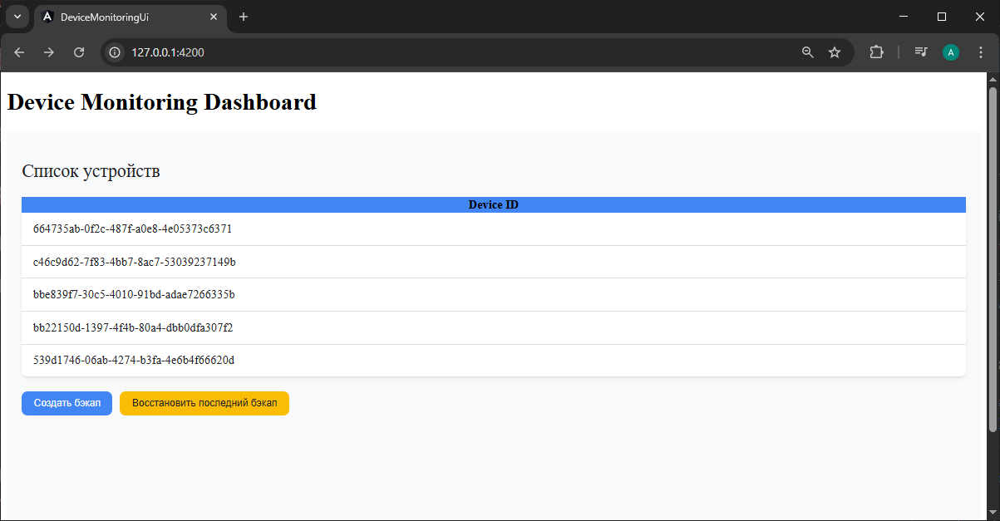
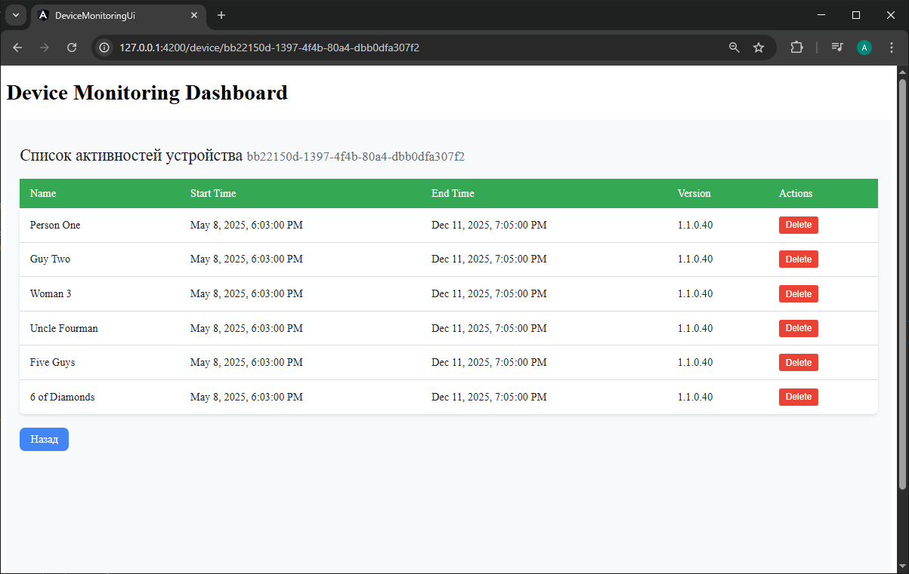
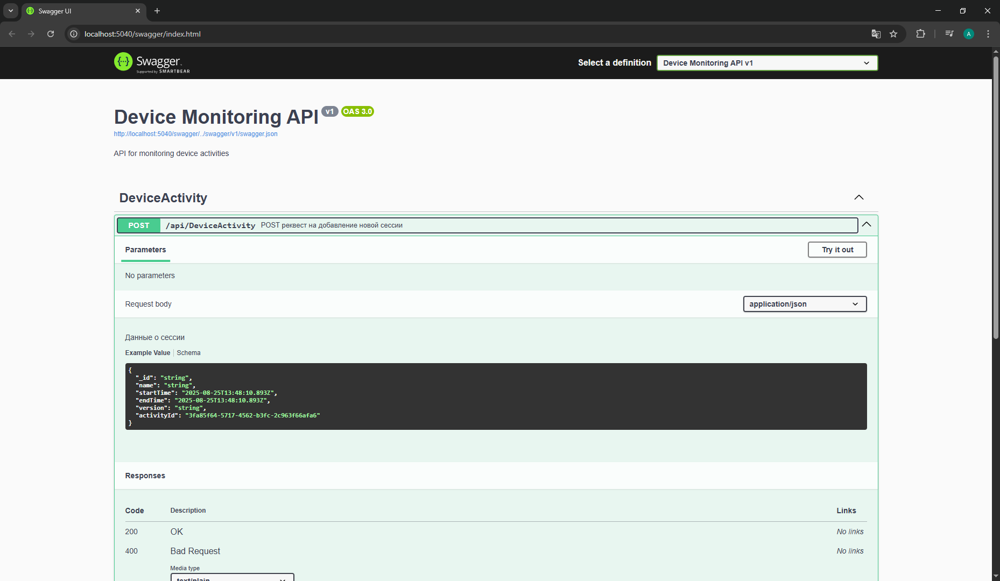
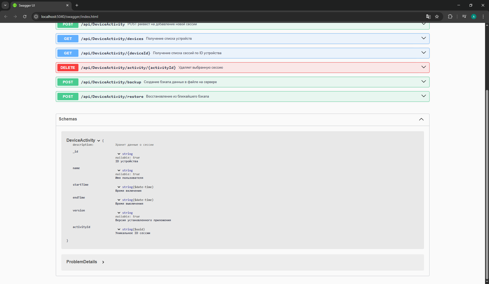
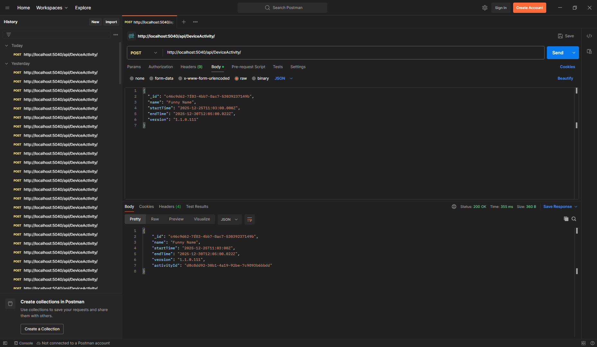
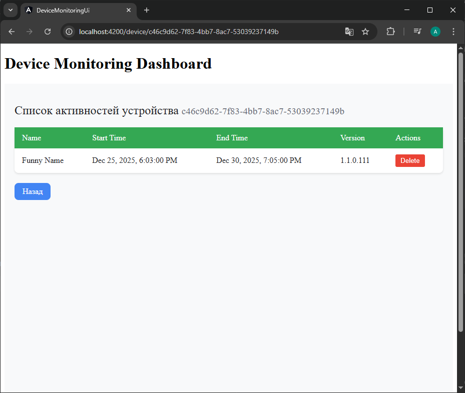

# Сервис мониторинга стороннего приложения

Full-stack веб-приложение для отслеживания статистики активности устройств.
Состоит из backend на .NET 8 Web API и frontend на Angular 15.



## Основные функции
- Приём и хранение статистики активности устройств через API
- Angular SPA (Single Page Application) для визуализации данных
- Просмотр всех устройств и истории активности
- Ручное удаление записей об отдельных сессиях
- Резервное копирование данных в файл и восстановление из файла

## Технические особенности
- .NET Web API с документацией Swagger
- Angular 15 SPA
- Стилизация с использованием LESS
- Развёртывание в докере с docker-compose
- Логирование backend и frontend
- Хранение данных in-memory

## Стек технологий
Backend:
- .NET 8
- ASP.NET Core Web API
- Swagger/OpenAPI
- In-memory хранение данных

Frontend:
- Angular 15
- TypeScript
- LESS CSS препроцессор

DevOps:
- Docker
- Docker Compose
- nginx

## Структура проекта

```
DeviceMonitoring/
├── DeviceMonitoringAPI/          # .NET Web API
│   ├── Controllers/
│   ├── Data/
│   ├── Models/
│   ├── Properties/
│   │   └── launchSettings.json
│   ├── Services/
│   ├── DeviceMonitoringAPI.csproj
│   ├── Dockerfile
│   └── Program.cs
├── DeviceMonitoringUi/           # Angular SPA
│   ├── src/
│   │   ├── app/
│   │   │   ├── components/
│   │   │   ├── environments/
│   │   │   ├── models/
│   │   │   └── services/
│   │   └── assets/
│   ├── angular.json
│   ├── Dockerfile
│   └── package.json
├── docker-compose.yml
└── README.md
```

## Быстрый старт

### Требования

- .NET 8 SDK
- Node.js 18+
- Docker (необязательно)
- Angular CLI 15 (npm install -g @angular/cli@15)

## Запуск без Docker

1. **Запуск API:**
   ```bash
   cd DeviceMonitoringAPI
   dotnet run
   ```

   API будет доступно по адресу: http://localhost:5040 \
   Документация Swagger: http://localhost:5040/swagger

2. **Запуск Angular приложения:**
    ```bash
    cd DeviceMonitoringAPI
    dotnet run
    ```

    Приложение будет доступно по адресу: http://localhost:4200 \

## Запуск с Docker

**Собрать и запустить контейнеры:**
   ```bash
   docker-compose up --build
   ```

Приложение будет доступно по адресам:
- Frontend: http://localhost:4200
- Backend API: http://localhost:5040
- Swagger: http://localhost:5040/swagger

## Пример запроса

   ```json
   POST /api/DeviceActivity
   Content-Type: application/json

   {
      "_id": "f695ea23-8662-4a57-975a-f5afd26655db",
      "name": "John Doe",
      "startTime": "1980-01-02T00:00:00.000Z",
      "endTime": "1980-01-04T00:00:00.000Z",
      "version": "1.0.0.56"
   }
   ```

# Скриншоты

## Главная страница: 


## Список активностей устройства



## Документация Swagger:





## Тест Post реквеста с помощью Postman





# Автор

* С автором проектма можно связаться по email: burdiyanu.a@gmail.com.
* Telegram: @burdiyanu

# Github

Проект выложен на github по адресу: https://github.com/boromirl/C_sharp_test_task